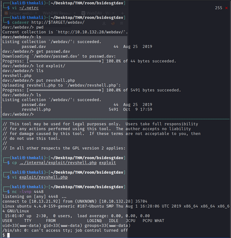
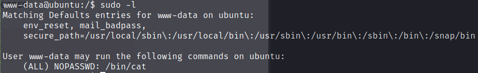

# DAV
  

boot2root machine for FIT and bsides guatemala CTF  

Yet another Bside Guatemala CTF VM for our hacking pleasure.  

Steps to root will be familiar  

- [x] Enumerate
- [x] Research potential exploits if known platform or webApp
- [x] Get foothold
- [x] Read User level flag(s)
- [x] Escalate privileges
- [x] Read Root flag(s)

Let's begin...  

## Enumeration  

As always I feed `nmap` with the output from `rustscan`  
`rustscan -r 1-65535 $TARGET -- "-A -sV -sC -oN scans/nmap_init_allPorts"`  


```sh

# Nmap 7.93 scan initiated Sun Oct  9 15:36:11 2022 as: nmap -A -sV -sC -oN scans/nmap_allPorts -vvv -p 80 10.10.132.28
Nmap scan report for 10.10.132.28
Host is up, received syn-ack (0.33s latency).
Scanned at 2022-10-09 15:36:11 EDT for 15s

PORT   STATE SERVICE REASON  VERSION
80/tcp open  http    syn-ack Apache httpd 2.4.18 ((Ubuntu))
| http-methods: 
|_  Supported Methods: GET HEAD POST OPTIONS
|_http-title: Apache2 Ubuntu Default Page: It works
|_http-server-header: Apache/2.4.18 (Ubuntu)

Read data files from: /usr/local/bin/../share/nmap
Service detection performed. Please report any incorrect results at https://nmap.org/submit/ .
# Nmap done at Sun Oct  9 15:36:26 2022 -- 1 IP address (1 host up) scanned in 15.90 seconds
```  

Nothing but _Web_  
`Port 80` nearly always looks juicy.  
Let's see where some directory busting leads us  

```sh
- Nikto v2.1.6/2.1.5
+ Target Host: 10.10.132.28
+ Target Port: 80
+ GET The anti-clickjacking X-Frame-Options header is not present.
+ GET The X-XSS-Protection header is not defined. This header can hint to the user agent to protect against some forms of XSS
+ GET The X-Content-Type-Options header is not set. This could allow the user agent to render the content of the site in a different fashion to the MIME type
+ HEAD Apache/2.4.18 appears to be outdated (current is at least Apache/2.4.37). Apache 2.2.34 is the EOL for the 2.x branch.
+ GET Server may leak inodes via ETags, header found with file /, inode: 2c39, size: 590fce4d4ea8c, mtime: gzip
+ OPTIONS Allowed HTTP Methods: GET, HEAD, POST, OPTIONS 
+ OSVDB-3233: GET /icons/README: Apache default file found.
```  

Not much help there  

```sh
$ FFUF Report

  Command line : `ffuf -u http://10.10.132.28/FUZZ -w /usr/share/seclists/Discovery/Web-Content/raft-medium-directories-lowercase.txt -o scans/fuzz_dir.md -of md`
  Time: 2022-10-09T16:35:22-04:00
  | webdav        | http://10.10.132.28/webdav        | 2366 | 401 | 459    | 42   | 15  | text/html; charset=iso-8859-1 | 327.036041ms |
  | server-status | http://10.10.132.28/server-status | 3781 | 403 | 300    | 22   | 12  | text/html; charset=iso-8859-1 | 326.819155ms |
  |   [:space:]   | http://10.10.132.28/              | 3809 | 200 | 11321  | 3503 | 376 | text/html                     | 324.905262ms |
  
```  

Not much here either, but `ffuf` **did** find a `/webdav/` directory. We'll bust 
that next.  

```sh
$ FFUF Report

  Command line : `ffuf -u http://10.10.132.28/webdav/FUZZ -w /usr/share/seclists/Discovery/Web-Content/raft-medium-directories-lowercase.txt -o scans/fuzz_webdav.md -of md -fs 459`
  Time: 2022-10-09T16:56:20-04:00

  | FUZZ | URL | Redirectlocation | Position | Status Code | Content Length | Content Words | Content Lines | Content Type | Duration | ResultFile |
  | :- | :-- | :--------------- | :---- | :------- | :---------- | :------------- | :------------ | :--------- | :----------- |
  
```  

Nada. Time for the next step  

## Research our target  

So it seems that this `/webdav/` directory may be indicating the server speaks 
in [WebDav](https://en.wikipedia.org/wiki/WebDAV), a protocol that "provides a framework for users to create, change and move documents on a server."  
Sounds like fun. Create, like drop a webshell? Change, manipulate server settings? 
Move, critical documents to our own host? We shall see now won't we?  

A home for the protocol spec seems to be [WebDav Resources](http://www.webdav.org). A 
site so old it is still provided over plain `http` and is describing, in (ahem) internet terms, an **_ancient_** network technology. The most so called recent news is dated Nov 1, 2009. Something tells me there will be serious flaws on the _DAV_ server that are relatively easy to take advantage of.  

My suspicions had merit. A simple web [search](https://search.brave.com/search?q=default+credentials+webdav&source=web) leads us directly to valid [OMG not again] **default** credentials that had been left in place.  A [site](http://xforeveryman.blogspot.com/2012/01/helper-webdav-xampp-173-default.html) near the top of that search list makes comment about this being a design decision of the Xampp version of WebDav and that the default install, in the author's opinion, does not do enough to warn users of the platform that default creds are **enabled** and should be changed. Well, them's the breaks. Now I say break, but we need 
not break anything here. The **defaults** for this WebDav server are insecure. Well known 
credentials are created, then enabled by the default install of this Xampp branded software.  And this server seems to still be in _Default Install_ configuration.

## Exploit  

I used [Cadaver](http://www.webdav.org/cadaver/) to access this WebDav portal using the 
default credentials. This client is available in the Kali Linux repos or follow the [link](http://www.webdav.org/cadaver/). The `cadaver` manpage informs us to store credentials in 
`~/.netrc`, but it's not actually necessary to to so. If `~/.netrc` doesn't exist or does not have credentials for the site you are accessing with `cadaver` you will be prompted to provide them at start-up.  

[](assets/cadaver2login.png)  

You may be wondering about the lone file found in the root of this Distributed Authoring service. I was too and snatched it up straight away. I'ts content appeared to be the credentials I had just used stored in the format Apache knows, similar if not the same as what one might find in `.htpasswd`.  

`wampp:$apr1$Wm2VTkFL$PVNRQv7kzqXQIHe14qKA91`  

Go ahead and crack that hash with John the Ripper or HashCat, but I couldn't be bothered. After all, I already had a foothold using the creds that file seemed to either back-up or set.  

Next up you can see I uploaded a [webshell](https://en.wikipedia.org/wiki/Web_shell) while a netcat listener waited for a connection that did eventually arrive.  
However insult was added to my injury when I discovered `www-data` had **sudo** privileges on this host.  

  

`sudo /bin/cat /root/root.txt` and this box is done.  

Not sure how or why this room gets a medium difficulty rating. I did have to do a minimal 
amount of research, but it still felt awful Skr1P7k1D13 to me. Maybe I'm just jaded in my old age.  

That's a wrap, for now.
