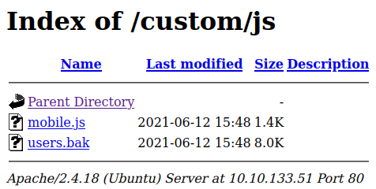
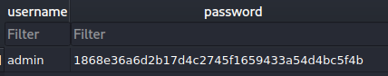
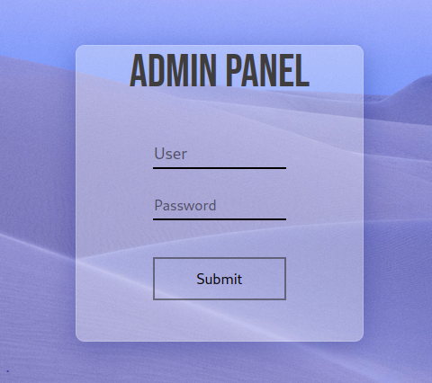

# Mustacchio

  

Easy boot2root Machine  
by [zyeinn](https://tryhackme.com/p/zyeinn)  

## Enumeration  

As always our tool of choice, being so familiar  

```
Nmap 7.93 scan initiated Sun Oct  2 07:59:10 2022 as: nmap -Pn -sC -sV -vv -oN scans/mustacchio_init -T4 10.10.133.51
Nmap scan report for 10.10.133.51
Host is up, received user-set (0.24s latency).
Scanned at 2022-10-02 07:59:10 EDT for 31s
Not shown: 998 filtered tcp ports (no-response)
PORT   STATE SERVICE REASON         VERSION
22/tcp open  ssh     syn-ack ttl 61 OpenSSH 7.2p2 Ubuntu 4ubuntu2.10 (Ubuntu Linux; protocol 2.0)
| ssh-hostkey: 
|   2048 581b0c0ffacf05be4cc07af1f188611c (RSA)
| ssh-rsa AAAAB3NzaC1yc2EAAAADAQABAAABAQC2WTNk2XxeSH8TaknfbKriHmaAOjRnNrbq1/zkFU46DlQRZmmrUP0uXzX6o6mfrAoB5BgoFmQQMackU8IWRHxF9YABxn0vKGhCkTLquVvGtRNJjR8u3BUdJ/wW/HFBIQKfYcM+9agllshikS1j2wn28SeovZJ807kc49MVmCx3m1OyL3sJhouWCy8IKYL38LzOyRd8GEEuj6QiC+y3WCX2Zu7lKxC2AQ7lgHPBtxpAgKY+txdCCEN1bfemgZqQvWBhAQ1qRyZ1H+jr0bs3eCjTuybZTsa8aAJHV9JAWWEYFegsdFPL7n4FRMNz5Qg0BVK2HGIDre343MutQXalAx5P
|   256 3cfce8a37e039a302c77e00a1ce452e6 (ECDSA)
| ecdsa-sha2-nistp256 AAAAE2VjZHNhLXNoYTItbmlzdHAyNTYAAAAIbmlzdHAyNTYAAABBBCEPDv6sOBVGEIgy/qtZRm+nk+qjGEiWPaK/TF3QBS4iLniYOJpvIGWagvcnvUvODJ0ToNWNb+rfx6FnpNPyOA0=
|   256 9d59c6c779c554c41daae4d184710192 (ED25519)
|_ssh-ed25519 AAAAC3NzaC1lZDI1NTE5AAAAIGldKE9PtIBaggRavyOW10GTbDFCLUZrB14DN4/2VgyL
80/tcp open  http    syn-ack ttl 61 Apache httpd 2.4.18 ((Ubuntu))
| http-methods: 
|_  Supported Methods: POST OPTIONS GET HEAD
|_http-title: Mustacchio | Home
|_http-server-header: Apache/2.4.18 (Ubuntu)
| http-robots.txt: 1 disallowed entry 
|_/
Service Info: OS: Linux; CPE: cpe:/o:linux:linux_kernel

Read data files from: /usr/local/bin/../share/nmap
Service detection performed. Please report any incorrect results at https://nmap.org/submit/ .
# Nmap done at Sun Oct  2 07:59:41 2022 -- 1 IP address (1 host up) scanned in 31.18 seconds
```

One disallowed entry in `robots.txt` -- wonder what it is?

`curl -s http://$TARGET/robots.txt`  

	User-agent: *
	Disallow: /

No help there, simply disallow robots rule.

Let's try to fuzz for some directories as nothing much is linked to from the Home Page.  
Not to mention all the _lorem ipsum_ content that give the impression this site is still under (un)active development.

  

Fuzzing with `ffuf` shows us at least one not so standard directory  

```
$ ffuf -u http://$TARGET/FUZZ -w /usr/share/seclists/Discovery/Web-Content/raft-medium-directories-lowercase.txt -o scans/fuzz.log

        /'___\  /'___\           /'___\       
       /\ \__/ /\ \__/  __  __  /\ \__/       
       \ \ ,__\\ \ ,__\/\ \/\ \ \ \ ,__\      
        \ \ \_/ \ \ \_/\ \ \_\ \ \ \ \_/      
         \ \_\   \ \_\  \ \____/  \ \_\       
          \/_/    \/_/   \/___/    \/_/       

       v1.5.0 Kali Exclusive <3
________________________________________________

 :: Method           : GET
 :: URL              : http://10.10.133.51/FUZZ
 :: Wordlist         : FUZZ: /usr/share/seclists/Discovery/Web-Content/raft-medium-directories-lowercase.txt
 :: Output file      : scans/fuzz.log
 :: File format      : json
 :: Follow redirects : false
 :: Calibration      : false
 :: Timeout          : 10
 :: Threads          : 40
 :: Matcher          : Response status: 200,204,301,302,307,401,403,405,500
________________________________________________

images                  [Status: 301, Size: 313, Words: 20, Lines: 10, Duration: 242ms]
fonts                   [Status: 301, Size: 312, Words: 20, Lines: 10, Duration: 231ms]
custom                  [Status: 301, Size: 313, Words: 20, Lines: 10, Duration: 232ms]
server-status           [Status: 403, Size: 277, Words: 20, Lines: 10, Duration: 233ms]
                        [Status: 200, Size: 1752, Words: 77, Lines: 73, Duration: 230ms]
:: Progress: [26584/26584] :: Job [1/1] :: 172 req/sec :: Duration: [0:02:35] :: Errors: 2 ::
```

Let's fuzz that diry too


	css                     [Status: 301, Size: 317, Words: 20, Lines: 10, Duration: 2083ms]
	js                      [Status: 301, Size: 316, Words: 20, Lines: 10, Duration: 4079ms]
	                        [Status: 200, Size: 1115, Words: 76, Lines: 18, Duration: 231ms]

The empty entry is the directory listing for the `/custom` directory. With Directory Listings turned on for this portion of the web site I have to wonder what's laying around  

  

Pull down that `users.bak` file and see that it's an sqlLite v3 database. I think there's a browser for those.

	$ file artifacts/user.bak
	artifacts/user.bak: SQLite 3.x database, last written using SQLite version 3034001,
	file counter 2, database pages 2, cookie 0x1, schema 4, UTF-8, version-valid-for 2

And it seems to contain a single piece of data that is a backup of admin creds  

  

Wonder where we can use these creds? Have yet to run across any login pages in the web app. _ssh_ is running on port 22...  
Guess that's worth a shot  

Umm... after we crack that hash %^D  

```
hashcat -m 100 "1868e36a6d2b17d4c2745f1659433a54d4bc5f4b" /usr/share/wordlists/rockyou.txt --show
1868e36a6d2b17d4c2745f1659433a54d4bc5f4b:bulldog19

```

Crap, need a key for ssh login  

	$ ssh admin@$TARGET                                             
	The authenticity of host '10.10.133.51 (10.10.133.51)' can't be established.
	ED25519 key fingerprint is SHA256:8ffSUaKVshwAGNYcOWTbXfy0ik5uNnUqe/0nXK/ybSA.
	This key is not known by any other names
	Are you sure you want to continue connecting (yes/no/[fingerprint])? yes
	Warning: Permanently added '10.10.133.51' (ED25519) to the list of known hosts.
	admin@10.10.133.51: Permission denied (publickey).

This **is** a custom web app, wonder if it has any _custom_ port mappings?  Time to get out the port scanner and scan the entire range from 1 - 65535. At least I don't have to rely on Nmap for that. `rustscan` goes much faster.  
Found another open port at 8765 in seconds  

It lead to this Admin Panel 

  

where I could successfully login. The Admin landing page has and interesting comment in the source  

	 <!-- Barry, you can now SSH in using your key!-->

So we need to find Barry's ssh private key. And I think we might do that using an **XXE** injection.  
There is a form on the page and the text area for the form is filled via a script in the page's headers.

```
<script type="text/javascript">
  //document.cookie = "Example=/auth/dontforget.bak";
  function checktarea() {
  let tbox = document.getElementById("box").value;
  if (tbox == null || tbox.length == 0) {
    alert("Insert XML Code!")
  }
}
```


That `alert()` will throw if there is no entry in the textarea on Submission.  
Time test for **XXE injection**  

_to be continued_